## 基于Java+Springboot+Vue的养老院管理系统(源码+数据库+12000字文档)111

## 一、系统介绍
本系统前后端分离，本系统分为销售、人事、服务、餐饮、财务、超级管理员六种角色

系统主要功能如下：
1) 首页统计：包括今日新增咨询、今日新增预定、今日新增合同、合同到期提醒、可售床位、本月业绩排行、业务趋势。
2) 营销管理：包括咨询和预定管理。
3)	入住管理：包括床位全景、入住签约、外出登记、来访登记、事故登记、退住申请。
4)	人员管理：包括长者档案、员工管理。
5)	服务管理：包括服务项目、护理等级和服务预定。
6)	餐饮管理：包括菜品管理、餐饮套餐和点餐。
7)	费用管理：包括预存充值、消费记录和退住审核。
8)	基础配置：包括营销模块的客户来源渠道、入住模块的房间类型和楼栋管理。
项目功能结构图
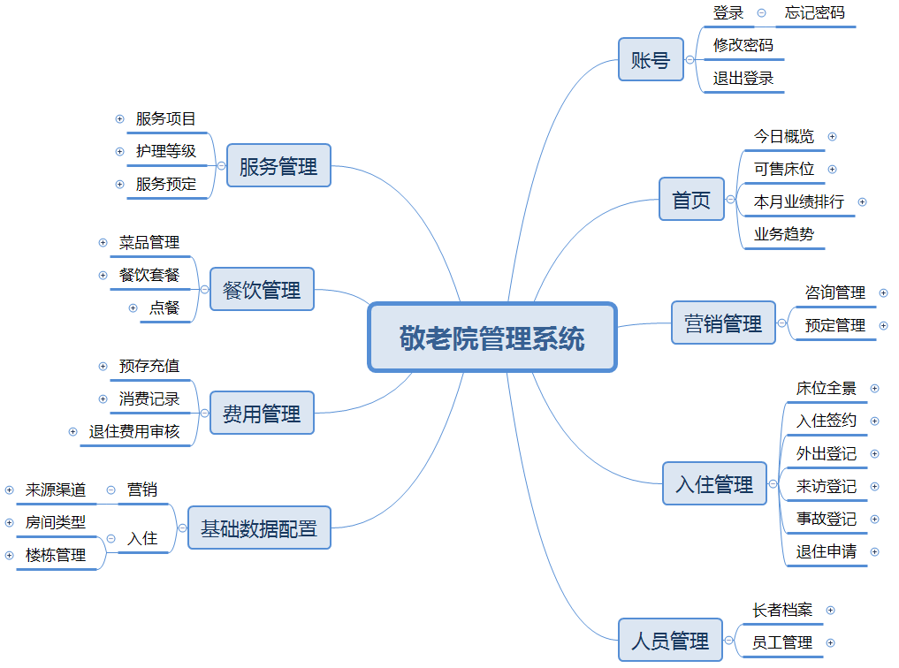
项目文档截图

### 1、销售员：
营销管理
### 2、人事：
人员管理
### 3、服务员：
服务管理
### 4、餐饮员：
人员管理
### 5、财务人员：
费用管理
### 6、超级管理员：
包括上述有功能、首页统计、入住管理、基础配置管理。

## 二、所用技术
后端技术栈：
- Springboot
- SpringMvc
- mybatisplus
- mysql
- SpringSecurity
- JWT
- redis
- Quartz

前端技术栈：
- Vue3
- elementPlus
- vue-router
- axios

## 三、环境介绍
基础环境 :IDEA/eclipse, JDK 1.8, Mysql5.7及以上, Node.js(14.21), Maven3.6, Vscode, redis5.0

所有项目以及源代码本人均调试运行无问题 可支持远程调试运行

## 四、页面截图

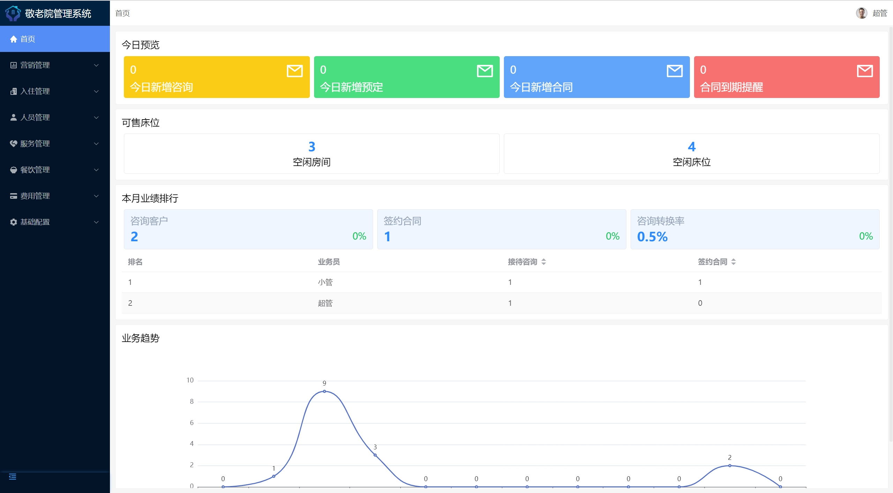

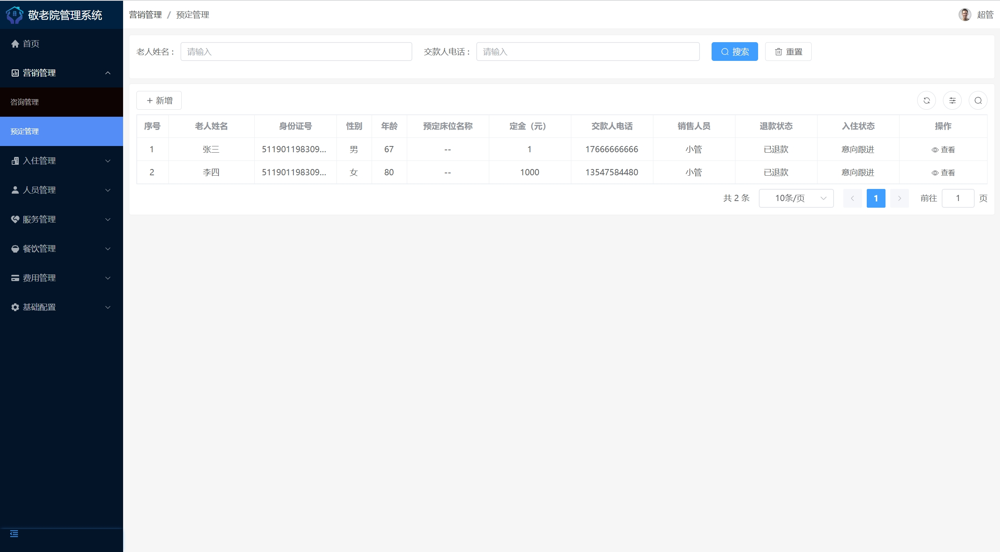

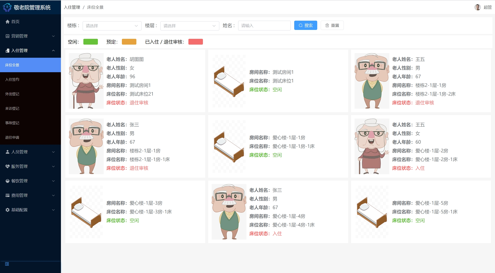
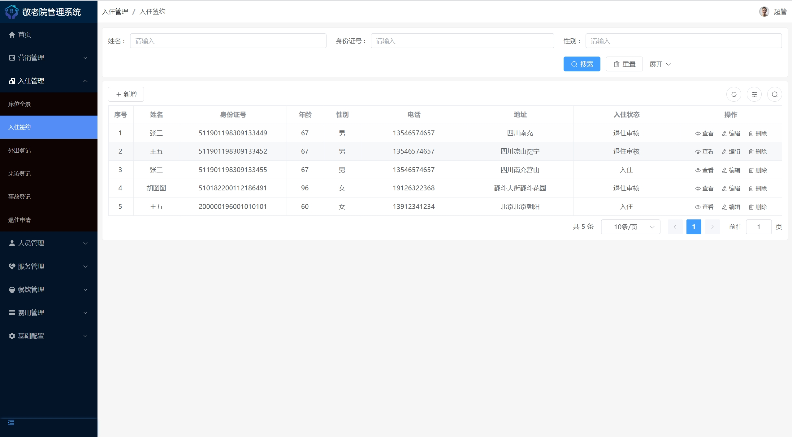

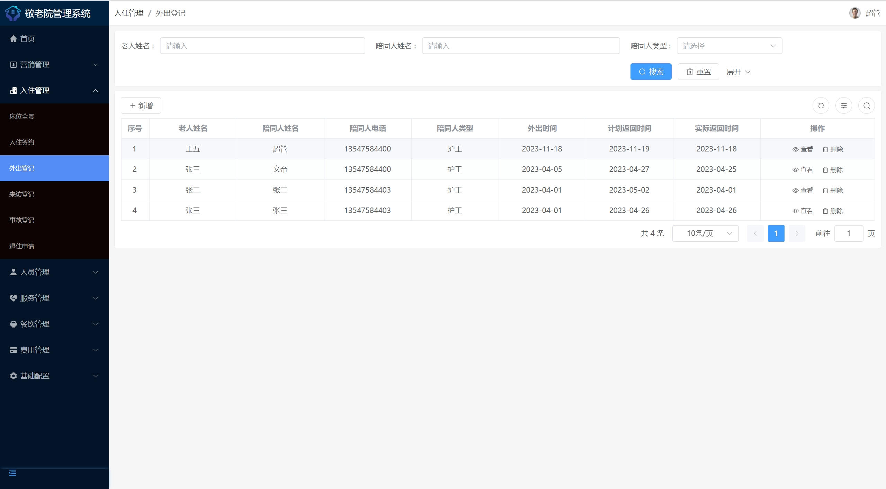
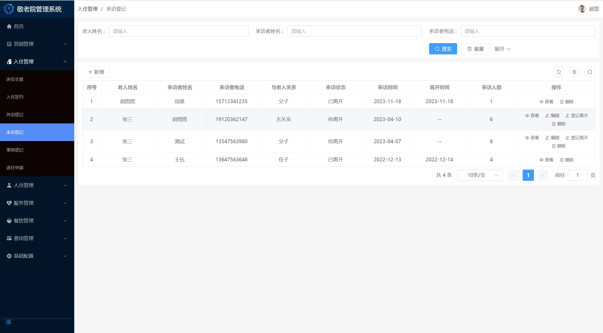

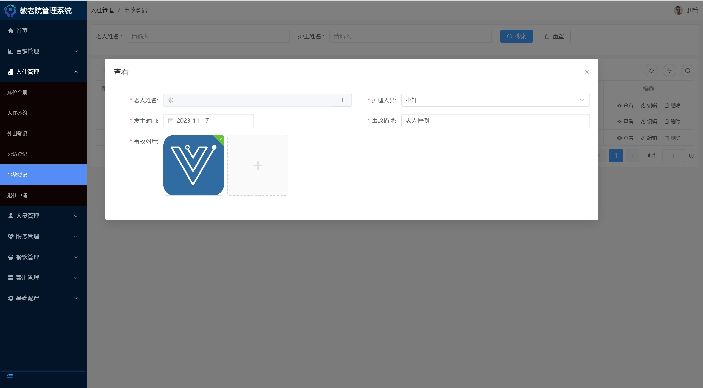
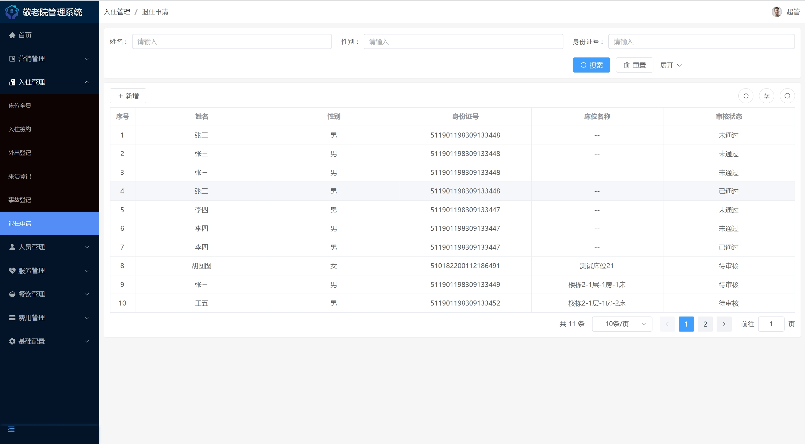

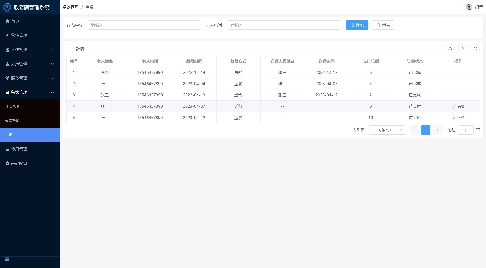
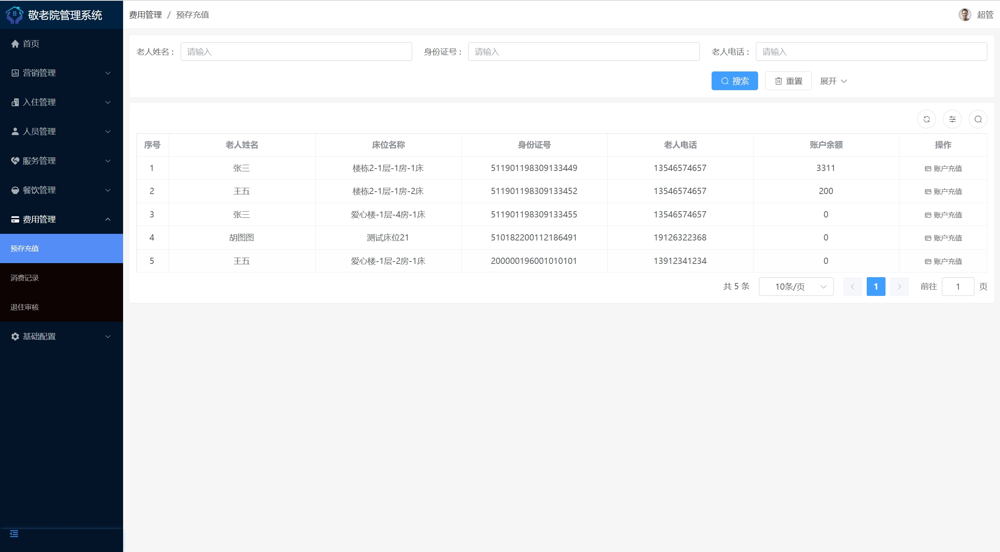

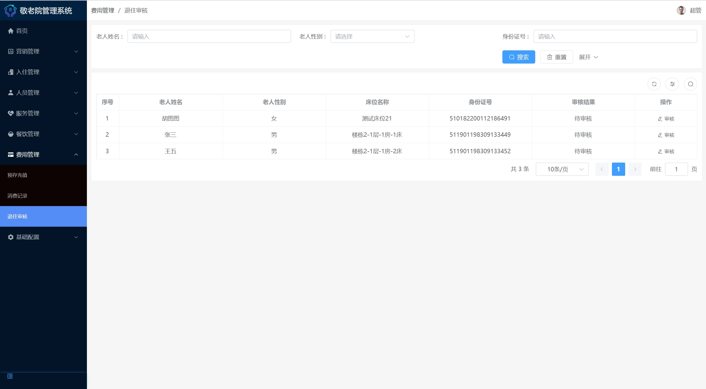

## 五、浏览地址
- http://localhost:8080/

超级管理员的账号密码为：13547584400/123456

销售员账号密码为：13547584401/123456

人事账号密码为：13547584402/123456

服务员账号密码为：18428167423/123456

餐饮员账号密码为：13647584403/123456

财务账号密码为：13547584404/123456

## 六、安装教程

1. 使用Navicat或者其它工具，在mysql中创建对应名称的数据库，并执行项目的sql

2. 使用IDEA/Eclipse导入springboot项目，导入时，若为maven项目请选择maven; 等待依赖下载完成

3. 修改resources目录下面application-dev.yml里面的数据库配置、redis配置和文件路径配置

4. com/ew/gerocomium/GerocomiumApplication.java启动后端项目

5. vscode或idea打开vue项目

6. 在编译器中打开terminal，执行npm install 依赖下载完成后执行 npm run serve,执行成功后会显示前台访问地址

